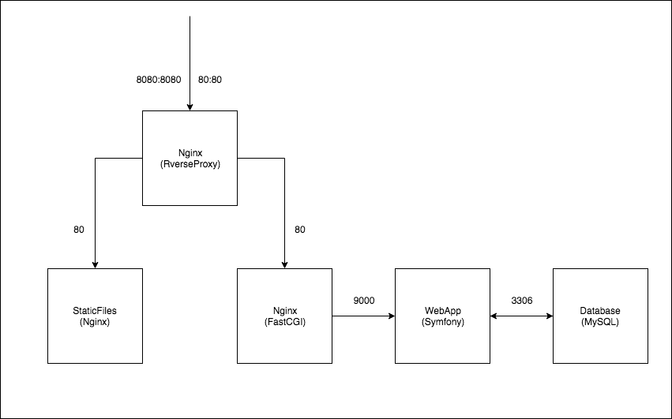

symfony-cms-on-docker
==============

## 概要
勉強用としてsymfony3.4でCMSのサンプルを作成

## インフラ構成について
Kubernetesで運用する事を前提として、開発環境も本番環境に近い構成にしてあります。  
ReverseProxy用のNginxとFastCGI用のNginxは統合できますが、ingress-nginxを利用することを前提とした作りにしてあります。

### 開発環境構成図

